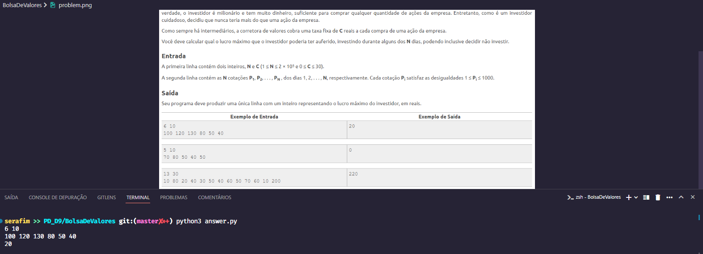
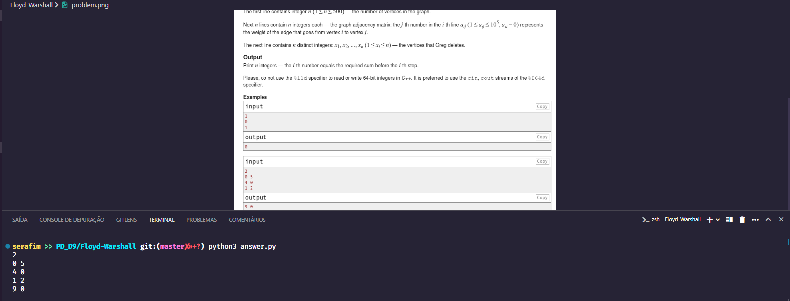

# Exercícios de Programação Dinâmica 

**Número da Lista**: 9<br>
**Conteúdo da Disciplina**: Programação Dinâmica<br>

## Alunos
|Matrícula | Aluno |
| -- | -- |
| 16/0141842  |  Philipe Rosa Serafim |
| 16/0143403  |  Renan Welz Schadt |

## Sobre 
O trabalho consiste na submissão de dois exercícios de juízes onlines que utilizam programação dinâmica.

## Screenshot




## Instalação 
**Linguagem**: Python<br>
Necessário ter Python3 instalado e configurado em seu computador.

## Uso 
Para executar os exercícios, é necessário entrar na pasta do exercício e executar o comando: ```python3 answer.py < input.txt```, nisso será possível verificar a saída no terminal e comparar com o output esperado da questão.

## Outros 
A execução do comando ```python3``` depende de como o Python está configurado em sua máquina, podendo variar.


